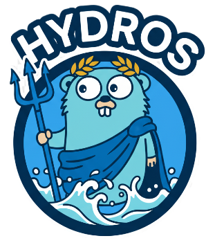

# Hydros: Simplified OIDC Provider




Built with inspiration from Ory Hydra & Kratos. Hydr/os is a Go-based OIDC provider implementing modern OAuth2.1 flows
for services that need robust identity and access management without the bloat.

Hydros provides a focused implementation of OAuth2.1 grant types designed for simplicity, auditability, and integration
into existing systems. Ideal for microservices, APIs, and internal platforms that require secure authentication and
token management.

## Key Features

- Support for core OAuth2.1 flows:
    - Authorization Code Grant with PKCE
    - Client Credentials Grant
    - Refresh Token Grant
- Built-in Go for performance and easy deployment
- Pluggable persistence using SQL backends
- Minimal, auditable codebase that’s easy to extend

## Getting started

```shell

```

## RFCs Tracker

RFC 6749 (OAuth 2.0 Core) defines the base OAuth framework. Since its publication, the OAuth Working Group has released
several companion specifications that extend and clarify the protocol — the complete list can be
found [here](https://oauth.net/2/). Hydros is under active development and is not yet production-ready.

| RFC                     | Name                                                            | Status        |
|-------------------------|-----------------------------------------------------------------|---------------|
| (Active Internet-Draft) | The OAuth 2.1 Authorization Framework                           | ⏳ Development |
| RFC 6750                | Bearer Token Usage                                              | ✅ Supported   |
| RFC 7636                | PKCE: Proof Key for Code Exchange                               | ⏳ Development |
| RFC 7662                | Token Introspection                                             | ✅ Supported   |
| RFC 9068                | JWT Profile for OAuth Access Tokens                             | ✅ Supported   |
| RFC 7009                | OAuth 2.0 Token Revocation                                      | ⏳ Development |
| RFC 8252                | OAuth 2.0 for Mobile and Native Apps                            | ⏳ Development |
| RFC 8693                | OAuth 2.0 Token Exchange                                        | Todo          |
| RFC 9126                | Pushed Authorization Requests (PAR)                             | Todo          |
| RFC 7521                | Assertion Framework for OAuth 2.0 Client Authn and Authz Grants | Todo          |
| RFC 7523                | JWT Profile for OAuth 2.0 Client Authn and Authz Grants         | Todo          |

### OpenID Connect

The complete list of specifications can be found [here](https://openid.net/developers/specs/).

| Specification                      | Status        |
|------------------------------------|---------------|
| OpenID Connect Core 1.0            | ⏳ Development |
| OAuth 2.0 Form Post Response Mode  | ⏳ Development |
| OpenID Connect RP-Initiated Logout | Todo          |
